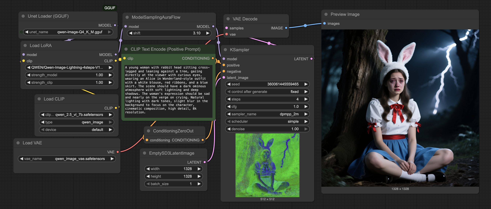
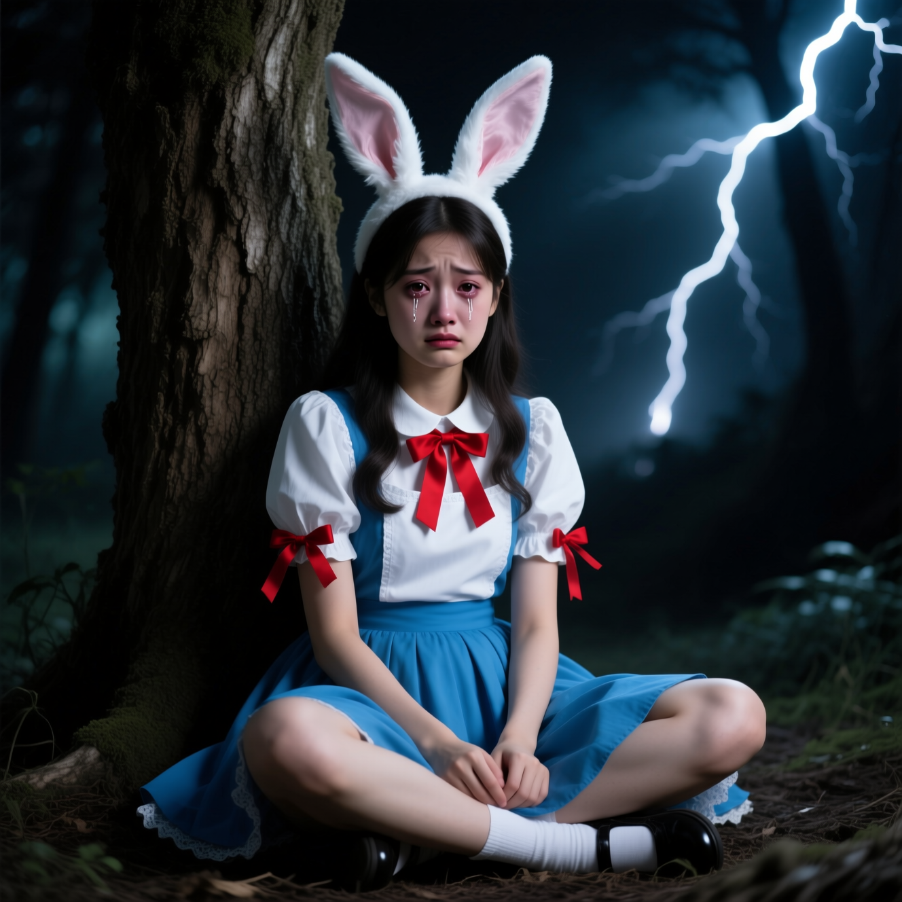

# Basic Qwen Workflow


This is a very basic workflow for generation of an image or set of images.  More complex workflows will reference this workflow and will describe what they do different related to this workflow.

## Nodes (See SDXL Workflow for basic nodes)
* Unet Loader (GGUF) --  This can be any GGUF file.  These are basic *.gguf files.
* Load LoRA -- Loads a Low-Rank Adaptation (in this example it is to reduce the Steps to 4 steps from 10 - 50).
* Load Clip -- Loads a text encoding model for translating the Text into something the Model understands.
* Load VAE -- Load the model to encode / decode latent/images.
* ConditionZeroOut -- This zeros out the input clip. We use this because Qwen doesn't do Negative prompts
* Model Sampling AuraFlow -- Designed to enhance the sampling process of model, tailored for the AuraFlow model.

## Basic Usage
This workflow is specific setup for using the GGUF model files. You can find the Qwen GGUFs at:

- [City96 Hugging Face](https://huggingface.co/city96/Qwen-Image-gguf)
- [Qwen Hugging Face](https://huggingface.co/Qwen/Qwen-Image/tree/main)

I recommend Q4 K M version.  I've tested a few and this provided the best balance between performance and quality for me on a Mac. This with the Qwen-Image-Lightning-4step-V1.0 LoRA takes about 120 - 220 seconds to generate an image.

Things to note about this workflow.  Because of the lightning LoRA you want to use 4 steps and CFG 1. Do note that if you use a CFG greater than 1 it will start to get "over burnt" and look strange. With this there is the Model Sampling AuraFlow which by default should be 3.1 (according to Qwen), but if you find your images are soft you may want to bump it up.

The CLIP Prompt for this model is a flow-based text model.  I'm still wrapping my brain around it, but in general it seems to be more consistent.  But it doesn't hurt after you have a basic simple prompt (i.e. "young women with rabbit head sitting cross legged in a dark forest") and pass it through an LLM with even a simple "Rewrite the following prompt to provide better output for Flux: {{Enter the above prompt}}" .. I use "Flux" in this case as the local LLM I have has no clue about AuraFlow or Qwen, but the output in general provides a better verbose output that can be cleaned up. The other thing to note about the CLIP prompt is we zero out the negative prompt.  Like with Flux we don't need or should use a negative prompt.

## Example
**Positive:**
```
A young woman with rabbit head sitting cross-legged and leaning against a tree, gazing directly at the viewer with curious eyes, wearing an Alice in Wonderland-style outfit with a white blouse, red ribbons, and a blue skirt. The scene should have a dark ominous atmosphere with soft lightning and deep shadows. The woman's expression should be sad and nearly on the verge on crying. Natural lighting with dark tones, slight blur in the background to focus on the character, cinematic composition, high detail, 8k resolution. 
```

**Model:** qwen_image-Q4_K_M

**Seed:** 360061445559466 (Fixed)

**Steps:** 4

**CFG:** 1

**Sampler Name:** dpmmpp_2m

**Scheduler:** simple


