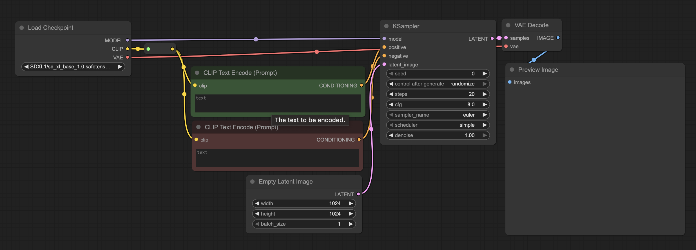
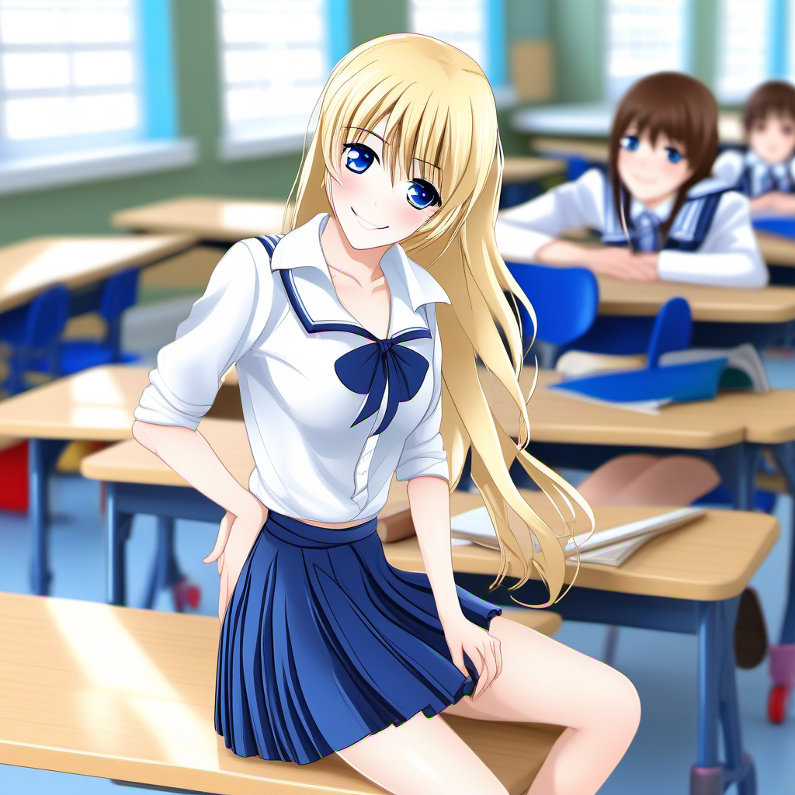

# Basic Workflow


This is a very basic workflow for generation of an image or set of images.  More complex workflows will reference this workflow and will describe what they do different related to this workflow.

## Nodes
* Load Checkpoint -- These can be any model in modesls/checkpoints.  These are basic *.safetensors files.
* Clip Text Encode -- This is either a Positive or Negative encoding based on the CLIP encoder (in this case it is built into the checkpoint).
* Empty Latent Image -- Create a "blank canvas" a specific size, and a specific amount of them.
* KSampler -- This is the heart that generate image(s) based on the text encoders and model.
  * Seed -- Used to generate random noise, using the same "seed" generates identical images.
  * Control after generate -- Used to define if the Seed should change after a run
  * CFG -- Controls how closely the generated image matches input conditions, value depends on loaded model.
  * Sampler Name -- Choose sampler for denoising, affects generation speed and style.
  * Scheduler -- Controls how noise is removed, affects generation process.
  * Denoise -- Determines noise removal ratio, lower values mean less connection to input image.
* VAE Decode -- Decode the Latent results into visual form.
* Preview Image -- Display Image (but don't save)

**Note:** you can replace "Preview Image" with "Save Image" which will save the output into the output/{{filename_prefix}}  where the prefix must include a partial name (i.e. myimage, but may include a subpath (i.e. mydir/myimage).

## Basic Usage
After selecting your model in the "Load Checkpoint" you need to provide positive and negative descriptions of what you wish the image to be.  This text will depend on the model and what CLIP it uses to decode this text, but the basic is that anything you wish to have within the image should be in the "postive" prompt (i.e. A young girl wearing a yellow jumper standing in a forest). Where things you wish not to be in the image should be in the "negative" prompt (i.e. bad hands, poor quality, NSFW, etc).

Most SD based CLIP loaders are keyword based and not fully natural language. Through trial and error I found the most effective way of formating for the most control is via sections.

## Example

**Positive:**
```
## Model Specials
award winning photo,

## Gender
1girl,

## hair
blonde long hair,
bangs,
BREAK,

## Face
blue eyes,
BREAK,

## Raw Body
meduim breasts, 
light skin,
collarbone,
BREAK,

## Upper body
light blue top,
BREAK,

## Lower body
dark blue miniskirt,
BREAK,

## Underskirt
white laced petticoat,
BREAK,

## Pose
sitting on chair,
smiling,
BREAK

## Scene
school classroom,
BREAK,

```
**Negative:**
```
text, worst quality, low quality, jpeg artifacts, ugly
```

**Model:** sd_xl_base_1.0

**Seed:** 312064562550522 (Fixed)

**Steps:** 20

**CFG:** 4.0

**Sampler Name:** euler_cfg_pp

**Scheduler:** simple




Notes:

1. Only apply Negative prompts when required to fix specific issues.  As they can have unexpected or bad affects on the image.  It is generally better to direct via positive prompts.  Like if you wish a character's legs to always be together when sitting use "legs together" in the Pose section. You can get example negative prompts by looking at the Civitai.com or other workflow sites.

2. You will notice the prompt wasn't fully followed and the petticoats were not applied.  You can attempt to fix this by changing the CFG or by adding a weight value like: (white laced petticoat:1.2)

3. There is no silver bullet.  You may adjust one thing and some other aspect be less valued by the CLIP encoder.  Other things that will change how the prompt is adhering is the Sampler used, Empty Latent size, and sead.


