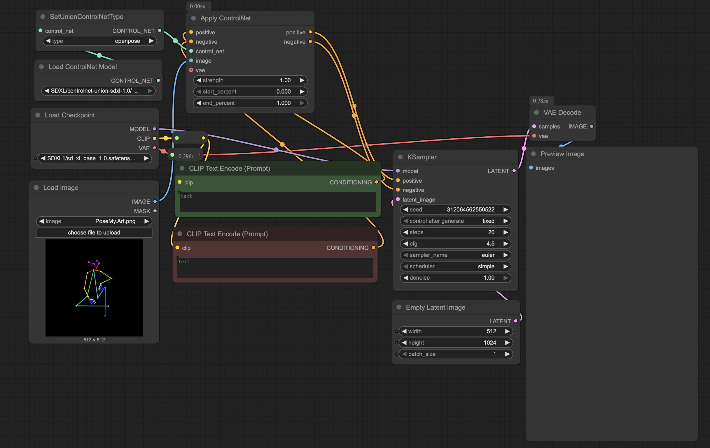
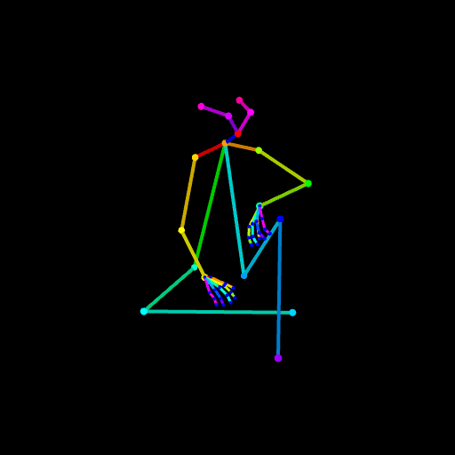

# ConrolNet Workflow


ControlNet setup is designed to help add guidence to the prompt for the scene or character pose through multiple different methology.  The common methology today are openpose, depth, scribble, or line art.

I will go over examples and discussion the above methods and when one would consider using them.


## Nodes
* Load ControlNet Model --  Load up a controlnet model as each model group (SDXL, Flux, IllustriosXL, etc) have their own model in models/controlnet directory and even within a model group some controlnets work better than others.
* SetUnionControlNetType -- Some ControlNet models combine multiple types together and are normally referred to as "Union" ControlNets.  You may want to specifically state what type you want appled.
* Apply ControlNet -- This takes in the Postive and Negative CLIPs apply the image processed through the selected ControlNet model and adds it to the CLIP data to influence the KSampler
  * Strength -- How strongly you want the ControlNet to be applied (0.00 is not at all, 1.00 is strongly apply)
  * Start Percent -- When to start applying the ControlNet
  * End Percent -- When to stop applying the ControlNet

## Basic Usage
See the [Basic Workflow](SD-Workflow-Basic.md) for an overview of the general process, but the major things to keep in mind that while KSampler is going through the steps in generating the image the ControlNet states how strong and when to start applying it.

If you apply the ControlNet too strongly you over constrain the KSampler and may end up with bad outbut.  Thus you may find you will need to lower it from the starting value of 1.00 in order to get a good result.

The other thing you may want to do is either delay when to apply or stop sooner than the number of steps the KSampler.  This I found is useful for depth and line art to give the Checkpoint some leeway to apply overrides in your CLIP prompt before the ControlNet takes over.  A practical example will be shown below.


## Example

### OpenPose
OpenPose is a stick figure format designed to describe facial and body positioning that other software can use to apply to models.  I recommend using [Pose My Art](https://posemy.art) or [OpenPose AI](https://openposeai.com) as freeish online tools to generate the image file.

An example of such a generation is:



This is best for single character generation when you want to use the Checkpoint to generate the character itself, but just needs better control over posing besides simple descriptions.  Do note that OpenPose ControlNet models don't always handle it perfectly if the pose is too tight.  As it lacks any depth information so it may not always know if an arm is to go behind or in front of another body part.

**Positive:**
```
## Model Specials
award winning photo,
BREAK,

## Gender
1girl,
BREAK,

## hair
red hair,
BREAK,

## Face
blue eyes,
smiling,
BREAK,

## Raw Body
meduim breasts, 
light skin,
BREAK,

## Clothing
white t-shirt,
blue jeans,
BREAK,
```
**Negative:**
```
text, worst quality, low quality, jpeg artifacts, ugly
```

**Model:** sd_xl_base_1.0

**Seed:** 312064562550522 (Fixed)

**Steps:** 20

**CFG:** 4.5

**Sampler Name:** euler

**Scheduler:** simple

**ControlNet Model:** ControlNet Union SDXL 1.0


Notes:

### Depth
.. To be discussed ..

### Scribbe
.. To play with, never used ..

### Line Art
.. To be discussed ..
